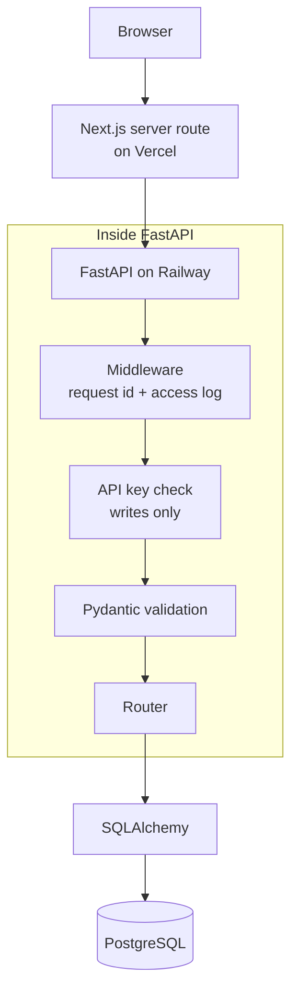

# Design & Architecture

A map of the pieces this project is built from, what each one does, and why it is
there. The domain is deliberately simple — a task has a title, a description, and
a completed flag — so the engineering around it is the interesting part.

## Architecture



A request from the browser hits the Next.js server first, which attaches the API
key and forwards it to FastAPI. Inside FastAPI it passes through middleware
(which stamps it with a request ID and logs it), then the API key check if it's a
write, then Pydantic validation. Only after all that does the endpoint function
run, using SQLAlchemy to talk to PostgreSQL. The response goes back out the same
way.

## HTTP & REST API

REST means the URL identifies a _thing_ and the HTTP method says what you want to
do with it. So there is one `/tasks` collection and one `/tasks/{id}` item, and
the method carries the verb:

| Method   | Path          | What it does                              |
| -------- | ------------- | ----------------------------------------- |
| `GET`    | `/`           | Health check                              |
| `GET`    | `/tasks`      | List tasks (`completed`, `skip`, `limit`) |
| `POST`   | `/tasks`      | Create a task                             |
| `GET`    | `/tasks/{id}` | Get one task                              |
| `PUT`    | `/tasks/{id}` | Replace a task — all fields required      |
| `PATCH`  | `/tasks/{id}` | Update some fields, leave the rest alone  |
| `DELETE` | `/tasks/{id}` | Delete a task                             |

Everything in and out is JSON. Status codes carry the outcome, so a client
doesn't have to read the body to know what happened: `200` OK, `201` Created,
`204` No Content (delete — there's nothing useful to return), `401` bad or
missing API key, `404` no such task, `422` the request body failed validation,
`500` our bug, `503` the database is unreachable.

## FastAPI

FastAPI is the web framework. It maps URLs to Python functions, parses the
request, and turns whatever the function returns into JSON. Because the endpoints
are annotated with Python types, it also generates the interactive `/docs` page
from the code.

Endpoints are grouped into a **router**. `app/routers/tasks.py` creates a router
with the prefix `/tasks`, so every route in that file lives under `/tasks` without
repeating it, and `main.py` mounts it. With one resource that's mostly tidiness,
but it's how you keep a bigger API from becoming one huge file.

**Dependency injection** is the FastAPI idea worth being able to explain. Instead
of an endpoint building what it needs, it declares it as a parameter and FastAPI
supplies it. Here that's the database session, which is opened and closed for
each request, and the API key check, which runs before a write endpoint's body
executes. Endpoints stay focused on their own logic, and a dependency can be
swapped out — which is how the tests point the app at a test database.

**Uvicorn** is the server that actually runs it. FastAPI defines the app; Uvicorn
listens on a port and speaks HTTP. Locally that's
`uvicorn app.main:app --reload`; in the container it's the same command without
reload.

## Pydantic

Pydantic validates data at the boundary. Each endpoint declares the shape it
accepts, and if the incoming JSON doesn't match, FastAPI returns a `422` before
the endpoint runs. That's why no endpoint contains an `if not title` check — by
the time the code runs, the data is already known to be valid. Unknown fields are
rejected rather than quietly ignored, so a client that misspells a field name
gets told.

There are four schemas in `app/schemas.py`, separate because each answers a
different question:

- **`TaskCreate`** — POST. Title required, no `id`; the database assigns that.
- **`TaskReplace`** — PUT. Every field required, because PUT replaces the whole
  task and a missing field shouldn't silently blank a column.
- **`TaskUpdate`** — PATCH. Every field optional, because leaving one out means
  "don't touch it."
- **`TaskResponse`** — what goes back out. It includes `created_at` and
  `updated_at`, which no input schema has, so a client can't set them.

One schema for all of these would lose information: a single shape can't say that
a field is required for PUT but optional for PATCH. The shared field rules are
written once and reused, so the four don't drift apart.

## SQLAlchemy

SQLAlchemy is the ORM — the layer that lets the code work with Python objects
instead of hand-written SQL. A `Task` object is a row, and changing one of its
attributes turns into an `UPDATE`.

`app/models.py` defines the **model**: the `tasks` table, its columns, their
types, and whether each can be null. This is a different job from the Pydantic
schemas — the model describes what the database can store, the schemas describe
what the API accepts and returns.

A **session** is the unit of work, and there's one per request. The write pattern
is `db.add(task)` to stage it, `db.commit()` to save it, then `db.refresh(task)`
to read back what the database filled in, like the generated id and the
timestamps. Reads are built up as queries — the list endpoint filters, orders,
and applies `skip`/`limit`, and SQLAlchemy turns that into a single SQL
statement. The ordering matters: without it the database is free to return rows
in any order, so pages could skip or repeat.

## PostgreSQL

PostgreSQL is the database, and it stores the tasks. There are three separate
ones, so no environment can disturb another:

- **Local** — a Postgres container started with `docker compose up -d`.
- **Test** — its own database, created automatically by the test suite on
  whichever Postgres it's pointed at.
- **Production** — a separate persistent Postgres service on Railway.

They're all real Postgres, which is the point. Running the tests on the same
engine used in production means the tests exercise how the database actually
behaves rather than something close to it.

## Alembic

The app doesn't create its own tables. Alembic owns the schema through
**migrations**: scripts in `alembic/versions/` that each describe one change, with
an upgrade and a downgrade, chained so they always apply in the same order.

You need this because a real database already has data in it. You can't drop and
recreate it just to add a column — you need a script that alters what's already
there. Migrations also make the schema versioned, so every environment ends up
with the same structure.

In development, `alembic revision --autogenerate` drafts a migration by comparing
the models to the database, and `alembic upgrade head` applies it. Autogenerate
writes a draft, not a finished migration — it can see the shape of the schema but
not the data in it, so anything touching existing rows is reviewed by hand. In
production, Railway runs `alembic upgrade head` before the new version starts.

## Configuration

Anything that changes between environments is an environment variable, so the
same code and the same Docker image run everywhere. `app/config.py` reads them
into a typed settings object with sensible defaults, so a bad value fails at
startup rather than halfway through a request.

- **`DATABASE_URL`** — which database to connect to.
- **`API_KEY`** — the shared secret for writes. Unset leaves writes open, which
  suits local development; the app logs a warning at startup so it's never a
  surprise.
- **`LOG_JSON`** — plain text logs locally, JSON in production.
- **`CORS_ORIGINS`** and **`LOG_LEVEL`** — allowed browser origins, and how much
  gets logged.

Real environment variables win over `.env`, which wins over the defaults in code.
`.env` is gitignored because it holds real values; `.env.example` is committed and
shows which variables exist, without any secrets in it.

## Security

Reads are public so the API can be browsed and demoed. Writes require an
`X-API-Key` header matching `API_KEY`, enforced on the POST, PUT, PATCH, and
DELETE routes.

This is a **write gate, not authentication**. There are no user accounts, the key
says nothing about who is calling, and everyone holding it can do the same
things. It stops a public deployment filling up with whatever strangers post; it
doesn't identify anyone.

The key lives on the Next.js server and never reaches browser code. Anything the
browser sends is visible in its network tab, so a key shipped to the client isn't
really secret.

## Middleware, Logging & Errors

**Middleware** is code that runs on every request, around the endpoint. This
project has one, and it does two things: it gives each request an ID, and it
writes the access log line — method, path, status, duration.

The **request ID** is reused from the incoming request if it already has one, so
an ID set by a proxy or the frontend follows the request across services, and
generated otherwise. It goes on the response header and on every log line for
that request, so a user quoting an ID is enough to find what happened.

Logs go to stdout, which is what containers and log collectors expect. Locally
they're plain text so you can read them; `LOG_JSON=true` switches to one JSON
object per line, so a log service can parse and search the fields.

**Errors** all come back in the same shape, modelled on the Problem Details
standard (RFC 9457):

```json
{
  "status": 404,
  "title": "Not Found",
  "detail": "Task not found",
  "request_id": "d4e2d4359c7a"
}
```

Validation failures add a list naming the fields that failed. One shape means a
client needs one code path for errors instead of one per kind. Unhandled
exceptions return a generic `500` that says nothing about our internals — the
real exception goes to the log under the same request ID.

## CORS

Browsers block a page on one origin from reading a response from a different
origin unless the server explicitly allows it. That's CORS: a browser rule, not
server-side access control, and it doesn't apply to server-to-server calls at
all.

The API is configured with a named list of allowed origins from `CORS_ORIGINS`,
rather than allowing everything.

In the current setup, though, the browser only ever talks to the Next.js server,
and that server calls FastAPI from the backend — so CORS never comes into it. The
config exists so the API can still be called directly from a browser during
development or by another client, not because the deployed frontend depends on
it.

## Testing / pytest

The suite is pytest, and it's mostly **integration tests**: a test sends a real
HTTP request through the app and checks the response and the database. That
covers routing, validation, the API key, the error shape, and the SQL all at
once, which is where the interesting bugs live. There are tests for the task
endpoints, validation, errors, logging, the API key, CORS, config, the health
check, and the migrations.

They run against **PostgreSQL**, in their own database, separate from the
development one — so what passes in tests reflects how production actually
behaves.

**Isolation** comes from transactions. The tables are built once for the whole
run, then each test runs inside a transaction that's rolled back when it
finishes. Nothing a test writes survives it, so tests can't leak into each other
or depend on the order they run in — and rolling back is much faster than
rebuilding the tables for every test.

## Docker

An **image** is a packaged filesystem plus a start command — a template. A
**container** is a running instance of one. You build the image once and run it
anywhere, which is what makes "works on my machine" less of a problem.

The **Dockerfile** builds the API image: a slim Python base, install
dependencies, copy in the app and the migrations, run as a non-root user, start
Uvicorn. Dependencies are installed before the application code is copied,
because Docker caches each step and rebuilds from the first thing that changed —
so editing a router doesn't reinstall everything. Only runtime dependencies go
in; the test and lint tools stay out.

**Docker Compose** runs the local stack. By default it starts just PostgreSQL, so
the app can run on the host with `--reload` for fast feedback. The Postgres data
lives in a named **volume**, which is storage that outlives the container — so
stopping it doesn't wipe the database. An optional profile runs the API in a
container too, which is closer to how it actually deploys.

## GitHub Actions / CI

Every push to `main` and every pull request triggers the CI workflow. It starts a
temporary PostgreSQL container, installs dependencies, runs the linter and
formatter check, and runs the full test suite against that database. A second job
builds the Docker image, so a Dockerfile that no longer builds fails here rather
than during a deploy.

CI and deployment are separate systems. CI checks the code; Railway watches the
repository and does its own build. Nothing in this repo wires one to the other.

## Railway / Deployment

Railway builds the app from the `Dockerfile` in this repo and runs the resulting
container. `railway.json` holds the deployment config.

Two parts of it matter. `alembic upgrade head` runs as a **pre-deploy step**,
before the new version starts, so the schema is always ready before any traffic
arrives. And the **health check** points at `/`, which runs a real query against
the database — checking only that the process is alive would report healthy while
every request was failing.

PostgreSQL is a **separate Railway service** with its own persistent storage, not
part of the app container. Containers are disposable and get replaced on every
deploy, so the database has to outlive them. The app finds it through
`DATABASE_URL`.

## Frontend / Next.js / Vercel

The frontend is a separate Next.js app deployed on Vercel, in its own repo.
Next.js can run code on the server as well as in the browser, and this design
depends on that: the browser calls a **server route** in the Next.js app, that
route adds the `X-API-Key` header and calls FastAPI, and the response comes back
the same way.

The reason for the extra hop is the API key. Anything the browser sends can be
read by whoever is using it, so a key in client-side JavaScript isn't secret.
Keeping it on the Next.js server means it's only ever sent server-to-server. A
useful side effect is that the browser only talks to its own origin, so CORS
never enters the picture.

## Environments

**Local development** — Postgres in Docker, FastAPI on the host with
`uvicorn --reload`. `API_KEY` unset so writes are open, text logs, config from
`.env` or the defaults.

**CI / testing** — GitHub Actions starts a throwaway Postgres, and pytest creates
its own test database on it. Everything is torn down when the job ends; nothing
persists.

**Production** — Railway builds the Docker image and runs the container, migrates
the database before starting, and connects to a separate persistent Postgres
service. `API_KEY` is set, `LOG_JSON=true`, and the health check gates traffic.

Same code in all three. Only the environment variables differ.

## Known Limitations

- **No user accounts and no task ownership.** Everyone shares one list. Adding
  users would mean real authentication, an owner column, and filtering every
  query by it.
- **The API key is a shared secret, not authentication.** It can't be revoked for
  one caller, and it doesn't identify anyone.
- **Reads are public and unlimited.** There's no rate limiting on them.
- **CORS headers are missing on unhandled 500s.** The browser reports those as a
  CORS failure rather than a 500, which is confusing while debugging.
- **Pagination is offset-based.** Fine at this size, but it gets slow on large
  tables and can skip rows if the data changes between pages.
- **No caching, queue, or background workers.** Nothing here needs them, and
  adding them would be complexity without a reason.
