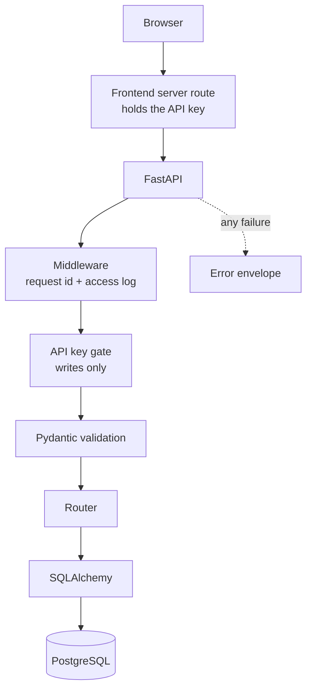

# Design decisions

Why the project is built this way; the [README](../README.md) covers what it
does. Most came from something breaking first, so the error is included.

## Architecture



Each decision below is about one of those boxes, roughly in the order a request
meets them.

## 1. One schema per operation, not one per table

A single `Task` schema mirroring the table lost data silently: `PUT` with a
partial body nulled every field the client had not sent. A schema shaped like a
table cannot express the difference between create, replace and modify, because
that difference is about the request, not the row.

So there are four: `TaskCreate`, `TaskReplace`, `TaskUpdate` and
`TaskResponse`. The three inputs share their rules through the `Title` and
`Description` annotations and differ only in what each treats as required,
optional or nullable — sharing the annotations is what keeps four schemas from
drifting apart.

## 2. Alembic owns the schema, not `create_all()`

Validation only helps if the table underneath matches what the code expects.
`create_all()` checks whether a _table_ exists and stops — it never compares
columns. Adding `created_at` changed nothing about the existing database:

```
app startup: OK, no errors
GET /tasks -> OperationalError: no such column: tasks.created_at
```

Tests stayed green, because the test database is rebuilt from the models every
run and can never be stale. No test of that shape catches this — the bug lives
in the gap between the models and a database that already exists.

Making the schema a versioned artifact closes that gap, at the cost of the app
no longer building its own database: every change needs a migration, and
`alembic upgrade head` has to run before the app serves traffic.

## 3. Autogenerate writes a draft, not a migration

Owning migrations does not mean the tool writes them. Autogenerate compares the
schema; it cannot see the rows. Making `completed` NOT NULL produced a
migration that failed on one hand-inserted `NULL` row, and only a human knows
the backfill is needed — written `= FALSE` not `= 0`, since `0` works on SQLite
and fails on Postgres. It is also blind to `VARCHAR` becoming `VARCHAR(200)`,
so those `alter_column` calls are hand-written. Every generated migration gets
reviewed before it lands; `alembic check` passing is a signal, not a guarantee.

## 4. Postgres, and the tests run on it

That `FALSE`/`0` split is the general problem: SQLite hid real behaviour. No
date type, so timestamps came back with nothing saying they were UTC; negative
`OFFSET` ignored; typing merely advisory. Each difference is small, and each
surfaces only in production.

Moving the tests mattered more than moving the app — reverting the `FALSE`/`0`
fix proves it, and a bug that needed a human reviewer is now caught in under a
second:

```
DatatypeMismatch: column "completed" is boolean but expression is integer
```

Cost: `pytest` now requires a running Postgres.

## 5. Tests roll back instead of rebuilding

A real database makes teardown the expensive part, so the schema is built once
per session and each test wrapped in a transaction and rolled back. Endpoints
call `db.commit()`, which a naive rollback cannot undo;
`join_transaction_mode="create_savepoint"` makes the session join the open
transaction through a SAVEPOINT, so `commit()` releases that savepoint and the
outer rollback still wins. Cost: sequences are not transactional, so ids are
consumed even for discarded rows — any test asserting `id == 1` is a bug.

## 6. One error shape for every failure

Three different error shapes reached clients depending on where the failure
happened, which pushes the parsing onto every caller. One envelope, modelled on
RFC 9457, replaces them:

```json
{
  "status": 404,
  "title": "Not Found",
  "detail": "Task not found",
  "request_id": "d4e2d4359c7a"
}
```

Registered on Starlette's `HTTPException` rather than FastAPI's, so an unmatched
URL or wrong method looks the same — those are raised below FastAPI and would
otherwise escape the format. Unhandled exceptions get a generic `500`, since
stack traces disclose paths, versions and sometimes connection strings. A test
plants a secret in an exception and asserts the client never sees it _and_ that
the log does — checking only the first passes if the error is swallowed.

## 7. Writes need a key; reads do not

A public deployment invites strangers to fill the database, but gating reads
makes the API impossible to browse. Splitting on the method keeps both: writes
require `X-API-Key`, `GET` stays open. This is a gate, not authentication —
there are no users, and the key says nothing about who is calling.

Keys are compared with `secrets.compare_digest`, because `==` returns as soon as
characters differ and leaks the key a character at a time; both sides are
encoded to bytes first, since headers arrive as latin-1 and `compare_digest`
raises `TypeError` on non-ASCII, turning a wrong key into a 500. A test asserts
no write method in the OpenAPI schema lacks a security requirement — a `PATCH`
once shipped without.

## 8. The key never reaches browser code

The gate is only worth having if the key stays secret, and anything a browser
sends is visible in its network tab — a key in client-side JavaScript is a
slightly inconvenient public string. So the browser calls a server route on the
frontend, which holds the key and forwards the request. It also removes the
cross-origin request, so CORS stops applying.

## Absent, and known limits

No auth, Redis, background workers, caching, service layer or repository pattern
— each defensible in a larger system, none justified here. What that leaves:

- **No authentication.** Tasks have no owner, so everyone shares one list.
- **CORS headers are missing on unhandled 500s.** Starlette handles those
  outside every user middleware, so nothing can wrap it.
- **`alembic check` cannot see column length changes.** See decision 3.
- **Reads are unrated.** Rate limiting was built and removed once the key made
  it redundant; the remaining risk is a read flood on an unadvertised URL.

## In summary

The application is small on purpose; the decisions are not. Each starts from an
observed failure rather than a convention — silent data loss, a green suite that
could not see a stale database, a bug only a reviewer could catch. The theme is
moving failures earlier, into a migration review or a test run, and being
explicit about what that costs. The limits above are listed for the same reason:
knowing where a design stops is part of the design.
